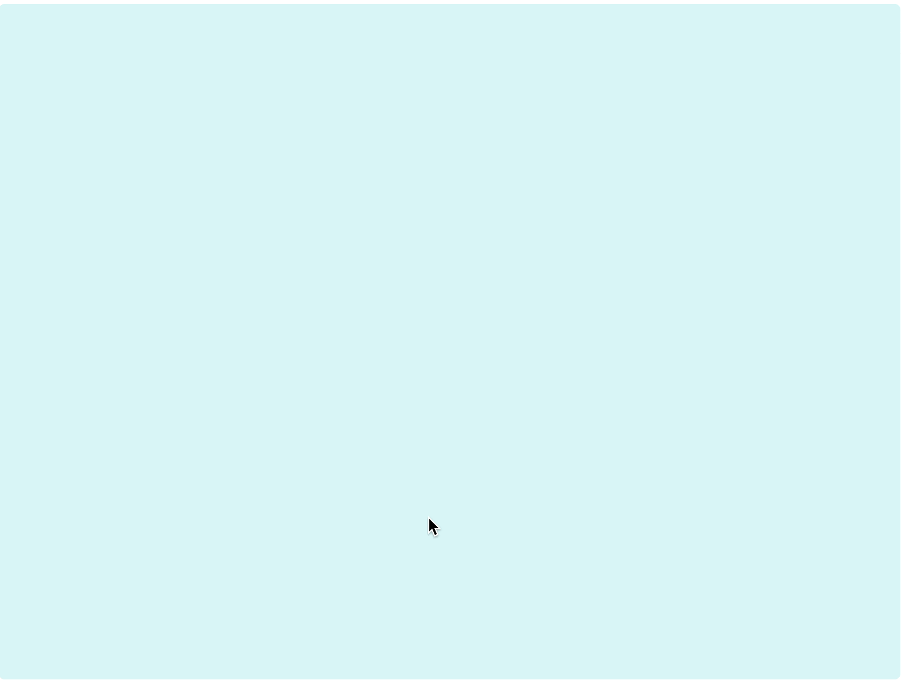

Demo version of a simple reward-effort decision-making task built using [phaser3](https://phaser.io/phaser3).

You can play the demo version [here](https://run.pavlovia.org/agnes.norbury/reward-effort-game-demo-2afc/) (no data will be saved).

The game world was compiled using [Tiled](https://www.mapeditor.org/) using art assets by [kenney](https://kenney.nl/).

UI functionality was built using [rexUI plugins](https://rexrainbow.github.io/phaser3-rex-notes/docs/site/ui-overview/) for phaser3.

The current version includes code specific to hosting and data collection via the [Pavlovia](https://pavlovia.org/) server, using functions from PsychoJS to enable data-saving (see discourse discussion [here](https://discourse.psychopy.org/t/pavlovia-phaser3-tips-for-writing-data/16238)).
